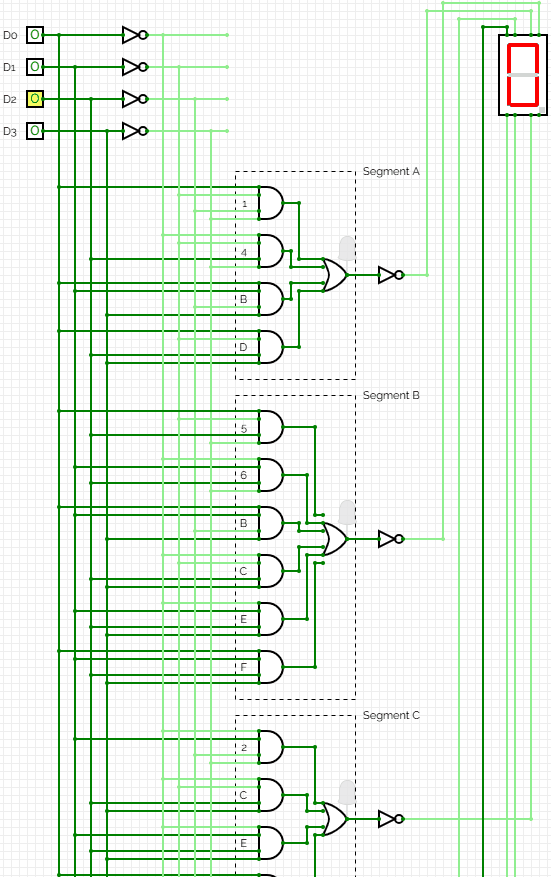
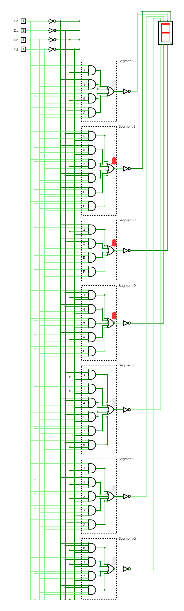

## 🔢 7-Segment Hexadecimal Decoder
This project implements a 4-bit binary to hexadecimal decoder using basic logic gates to drive a common anode 7-segment display.
It was designed, built, and simulated using CircuitVerse.org.

---

## ✨ Features
- 🔌 Fully functional 4-bit binary to hexadecimal decoder.

- 🔥 Designed for a common anode 7-segment display (LOW = segment ON).

- 🧠 Optimized logic design to reduce unnecessary gate usage.

- 🖥️ Fully tested and simulated using CircuitVerse.

---

## ⚡ How It Works
- Inputs: Four binary inputs (D0-D3).

- Logic gates: Combination of AND, OR, and NOT gates.

- Outputs: Seven control signals (segments A–G) to display the correct hexadecimal value.

Each input combination displays the corresponding hexadecimal value (0–F) on the 7-segment display.

---

## 🧮 4-Bit Binary to Hexadecimal Table

| D3 | D2 | D1 | D0 | Hexadecimal Output |
|----|----|----|----|--------------------|
| 0 | 0	| 0	| 0	| 0 |
| 0	| 0	| 0	| 1	| 1 |
| 0	| 0	| 1	| 0	| 2 |
| 0	| 0	| 1	| 1	| 3 |
| 0	| 1	| 0 |	0 |	4 |
| 0	| 1 |	0 |	1 |	5 |
| 0	| 1	| 1	| 0	| 6 |
| 0	| 1	| 1	| 1	| 7 |
| 1 |	0	| 0	| 0	| 8 |
| 1 |	0	| 0	| 1	| 9 |
| 1 |	0 |	1	| 0	| A |
| 1 |	0 |	1 |	1 |	B |
| 1 |	1 |	0 |	0 |	C |
| 1 |	1 |	0 |	1 |	D |
| 1 |	1 |	1 |	0 |	E |
| 1 |	1	| 1	| 1	| F |

---

## 🧩 Truth Table for 7-Segment Outputs

| Hex	| A	| B	| C | D	| E	| F	| G |
|-----|---|---|---|---|---|---|---|
| 0	| 0	| 0	| 0	| 0	| 0	| 0	| 1	|
| 1	| 1	| 0	| 0	| 1	| 1	| 1	| 1	|
| 2	| 0	| 0	| 1	| 0	| 0	| 1	| 0	|
| 3	| 0	| 0	| 0	| 0	| 1	| 1	| 0	|
| 4	| 1 |	0	| 0	| 1	| 1	| 0	| 0	|
| 5	| 0	| 1	| 0	| 0	| 1	| 0	| 0	|
| 6	| 0	| 1	| 0	| 0	| 0	| 0	| 0	|
| 7	| 0	| 0	| 0	| 1	| 1	| 1	| 1	|
| 8	| 0	| 0	| 0	| 0	| 0	| 0	| 0	|
| 9	| 0	| 0	| 0	| 0	| 1	| 0	| 0	|
| A	| 0	| 0	| 0	| 1	| 0	| 0	| 0	|
| B	| 1	| 1	| 0	| 0	| 0	| 0	| 0	|
| C	| 0	| 1	| 1	| 0	| 0	| 0	| 1	|
| D	| 1	| 0	| 0	| 0	| 0	| 1	| 0	|
| E	| 0	| 1	| 1	| 0	| 0	| 0	| 0	|
| F	| 0	| 1	| 1	| 1	| 0	| 0	| 0	|

> Note:

> - 0 = Segment ON

> - 1 = Segment OFF (for common anode displays)

> - Circuits designed using the Sum of Products (SOP) method of Boolean algebra where each term is a product of input variables or their complements & the final output is the sum of all these terms.
---

## 🖼️ Screenshot of the Circuit

---

## 🛠️ Technologies Used
- CircuitVerse.org — for digital circuit design and simulation.

- GitHub — for project hosting and version control.

- Logic design based on electronic engineering principles.

---

## 🚀 How to Use
- Clone the repository:

  > git clone https://github.com/Yasteer/7-Segment-Hexadecimal-Decoder.git
  
- Open the project file on CircuitVerse (.cv format).

- Simulate by toggling the input switches (D0–D3) and observe the 7-segment output.

---

## 🔮 Future Improvements
> Build a common cathode version.

> Further optimize logic gates using Karnaugh Maps.

> Simulate circuit in Tinkercad. 

> Construct and test the design on a physical breadboard with ICs.

---

## 📜 License
This project is licensed under the MIT License. See the LICENSE file for details.

---

## 👤 Author
- Created by Yasteer Sewpersad
- Electronic Engineering Portfolio of Evidence
